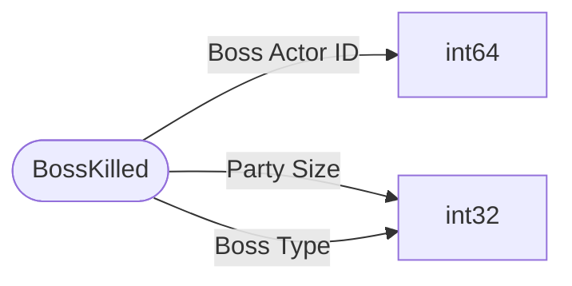

# BossKilled

`struct`

```mermaid
flowchart LR
  ROOT(["BossKilled"])
  ROOT -->|"Boss Actor ID"| int64["int64"]
  ROOT -->|"Party Size"| int32["int32"]
  ROOT -->|"Boss Type"| int32["int32"]
```

