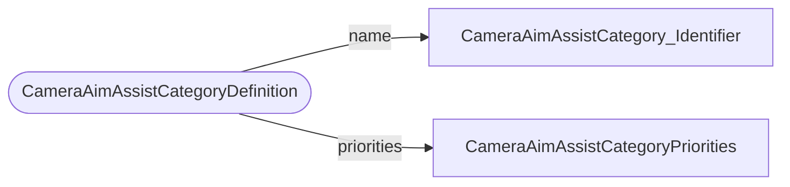

# CameraAimAssistCategoryDefinition

`struct`

```mermaid
flowchart LR
  ROOT(["CameraAimAssistCategoryDefinition"])
  ROOT -->|"name"| CameraAimAssistCategory_Identifier["CameraAimAssistCategory_Identifier"]
  ROOT -->|"priorities"| CameraAimAssistCategoryPriorities["CameraAimAssistCategoryPriorities"]
```

