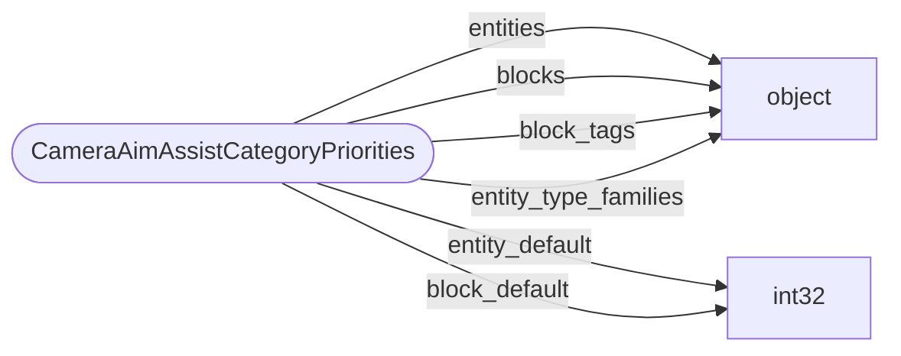

# CameraAimAssistCategoryPriorities

`struct`

```mermaid
flowchart LR
  ROOT(["CameraAimAssistCategoryPriorities"])
  ROOT -->|"entities"| object["object"]
  ROOT -->|"blocks"| object["object"]
  ROOT -->|"block_tags"| object["object"]
  ROOT -->|"entity_type_families"| object["object"]
  ROOT -->|"entity_default"| int32["int32"]
  ROOT -->|"block_default"| int32["int32"]
```

