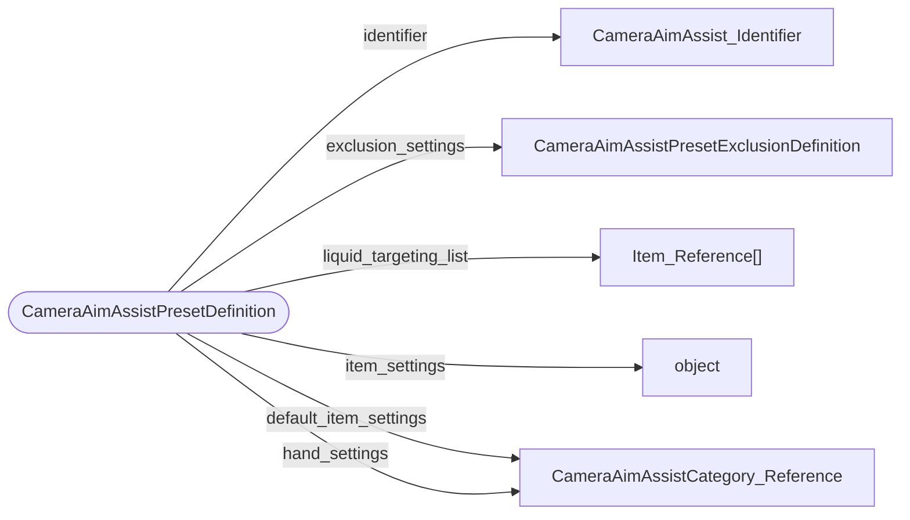

# CameraAimAssistPresetDefinition

`struct`

```mermaid
flowchart LR
  ROOT(["CameraAimAssistPresetDefinition"])
  ROOT -->|"identifier"| CameraAimAssist_Identifier["CameraAimAssist_Identifier"]
  ROOT -->|"exclusion_settings"| CameraAimAssistPresetExclusionDefinition["CameraAimAssistPresetExclusionDefinition"]
  ROOT -->|"liquid_targeting_list"| Item_Reference["Item_Reference[]"]
  ROOT -->|"item_settings"| object["object"]
  ROOT -->|"default_item_settings"| CameraAimAssistCategory_Reference["CameraAimAssistCategory_Reference"]
  ROOT -->|"hand_settings"| CameraAimAssistCategory_Reference["CameraAimAssistCategory_Reference"]
```

