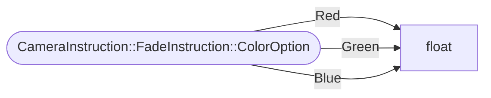

# CameraInstruction::FadeInstruction::ColorOption

`struct`

- protocol: 2168
- minecraft: 1.26.40

```mermaid
flowchart LR
  ROOT(["CameraInstruction::FadeInstruction::ColorOption"])
  ROOT -->|"Red"| float["float"]
  ROOT -->|"Green"| float["float"]
  ROOT -->|"Blue"| float["float"]
```

