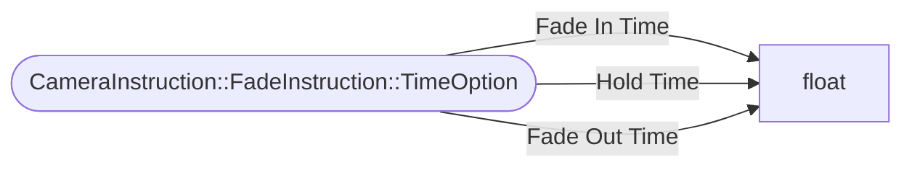

# CameraInstruction::FadeInstruction::TimeOption

`struct`

```mermaid
flowchart LR
  ROOT(["CameraInstruction::FadeInstruction::TimeOption"])
  ROOT -->|"Fade In Time"| float["float"]
  ROOT -->|"Hold Time"| float["float"]
  ROOT -->|"Fade Out Time"| float["float"]
```

