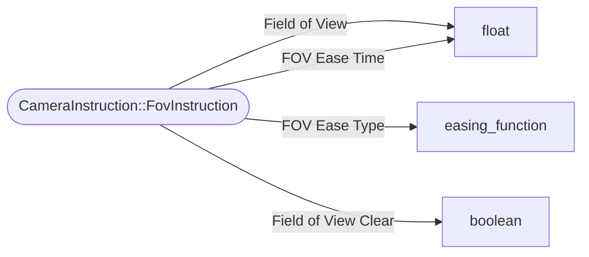

# CameraInstruction::FovInstruction

`struct`

```mermaid
flowchart LR
  ROOT(["CameraInstruction::FovInstruction"])
  ROOT -->|"Field of View"| float["float"]
  ROOT -->|"FOV Ease Time"| float["float"]
  ROOT -->|"FOV Ease Type"| easing_function["easing_function"]
  ROOT -->|"Field of View Clear"| boolean["boolean"]
```

