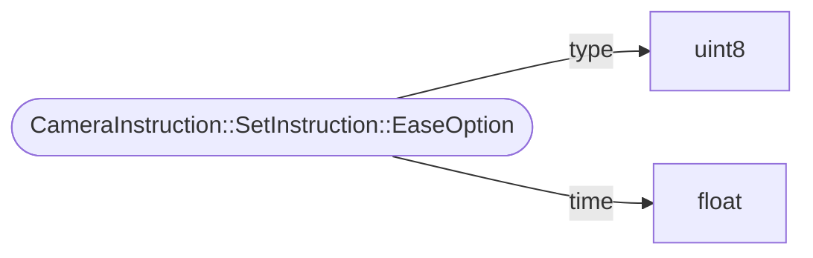

# CameraInstruction::SetInstruction::EaseOption

`struct`

```mermaid
flowchart LR
  ROOT(["CameraInstruction::SetInstruction::EaseOption"])
  ROOT -->|"type"| uint8["uint8"]
  ROOT -->|"time"| float["float"]
```

