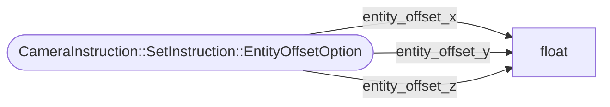

# CameraInstruction::SetInstruction::EntityOffsetOption

`struct`

```mermaid
flowchart LR
  ROOT(["CameraInstruction::SetInstruction::EntityOffsetOption"])
  ROOT -->|"entity_offset_x"| float["float"]
  ROOT -->|"entity_offset_y"| float["float"]
  ROOT -->|"entity_offset_z"| float["float"]
```

