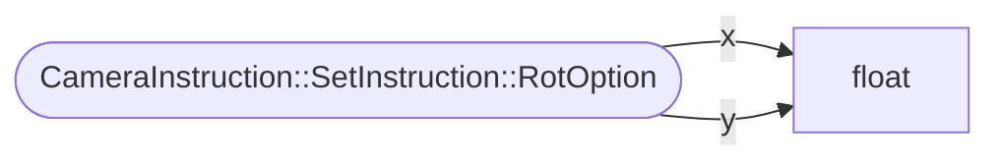

# CameraInstruction::SetInstruction::RotOption

`struct`

```mermaid
flowchart LR
  ROOT(["CameraInstruction::SetInstruction::RotOption"])
  ROOT -->|"x"| float["float"]
  ROOT -->|"y"| float["float"]
```

