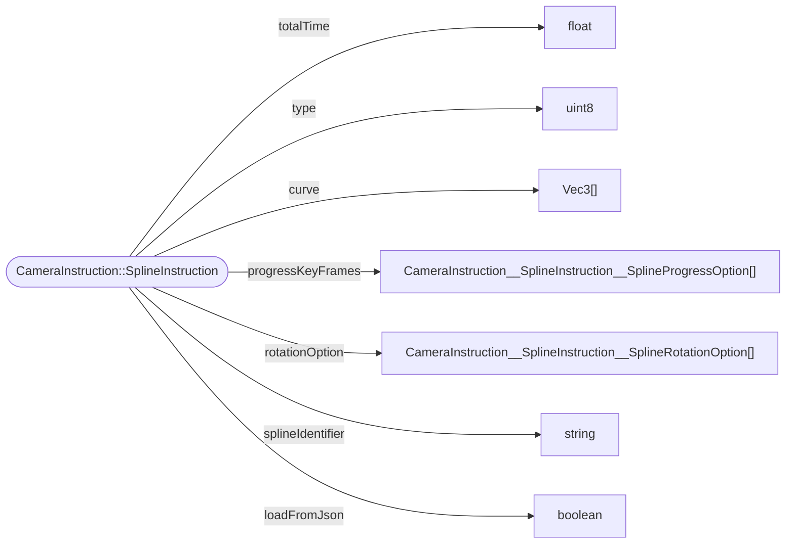

# CameraInstruction::SplineInstruction

`struct`

- protocol: 2168
- minecraft: 1.26.40

```mermaid
flowchart LR
  ROOT(["CameraInstruction::SplineInstruction"])
  ROOT -->|"totalTime"| float["float"]
  ROOT -->|"type"| uint8["uint8"]
  ROOT -->|"curve"| Vec3["Vec3[]"]
  ROOT -->|"progressKeyFrames"| CameraInstruction__SplineInstruction__SplineProgressOption["CameraInstruction__SplineInstruction__SplineProgressOption[]"]
  ROOT -->|"rotationOption"| CameraInstruction__SplineInstruction__SplineRotationOption["CameraInstruction__SplineInstruction__SplineRotationOption[]"]
  ROOT -->|"splineIdentifier"| string["string"]
  ROOT -->|"loadFromJson"| boolean["boolean"]
```

