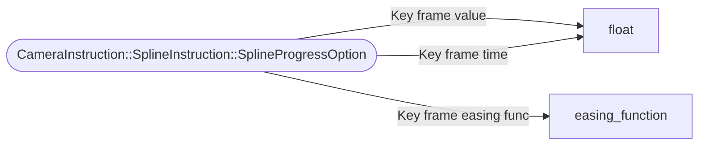

# CameraInstruction::SplineInstruction::SplineProgressOption

`struct`

```mermaid
flowchart LR
  ROOT(["CameraInstruction::SplineInstruction::SplineProgressOption"])
  ROOT -->|"Key frame value"| float["float"]
  ROOT -->|"Key frame time"| float["float"]
  ROOT -->|"Key frame easing func"| easing_function["easing_function"]
```

