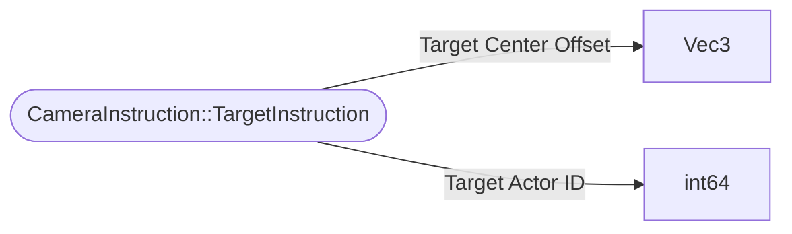

# CameraInstruction::TargetInstruction

`struct`

```mermaid
flowchart LR
  ROOT(["CameraInstruction::TargetInstruction"])
  ROOT -->|"Target Center Offset"| Vec3["Vec3"]
  ROOT -->|"Target Actor ID"| int64["int64"]
```

