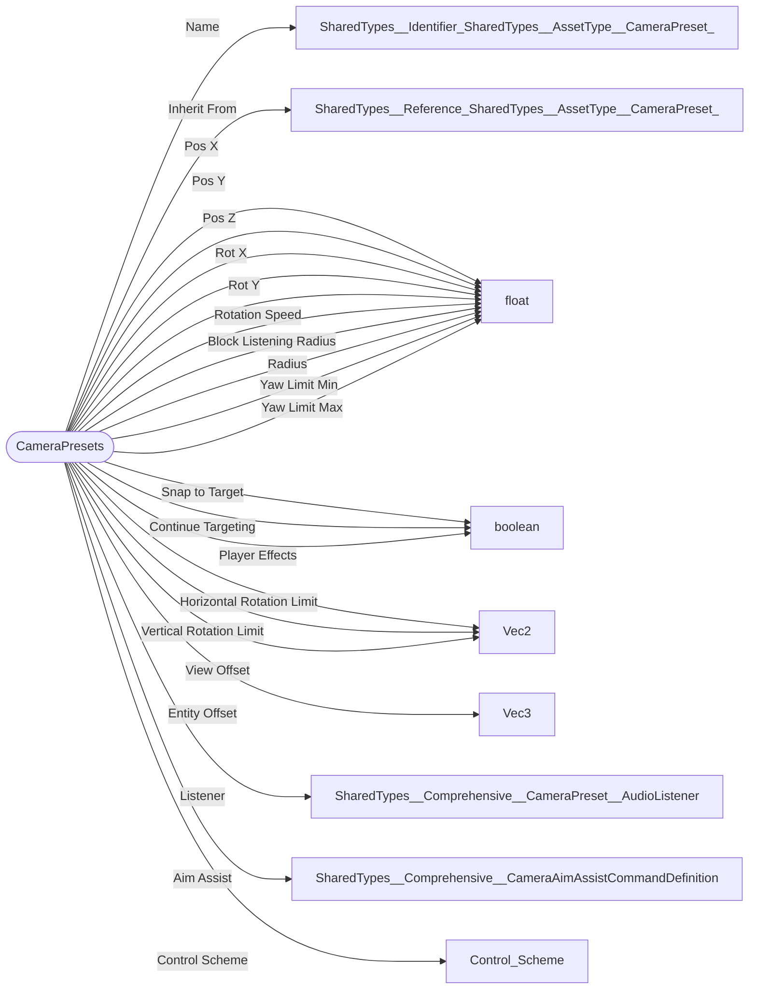

# CameraPresets

`struct`

```mermaid
flowchart LR
  ROOT(["CameraPresets"])
  ROOT -->|"Name"| SharedTypes__Identifier_SharedTypes__AssetType__CameraPreset_["SharedTypes__Identifier_SharedTypes__AssetType__CameraPreset_"]
  ROOT -->|"Inherit From"| SharedTypes__Reference_SharedTypes__AssetType__CameraPreset_["SharedTypes__Reference_SharedTypes__AssetType__CameraPreset_"]
  ROOT -->|"Pos X"| float["float"]
  ROOT -->|"Pos Y"| float["float"]
  ROOT -->|"Pos Z"| float["float"]
  ROOT -->|"Rot X"| float["float"]
  ROOT -->|"Rot Y"| float["float"]
  ROOT -->|"Rotation Speed"| float["float"]
  ROOT -->|"Snap to Target"| boolean["boolean"]
  ROOT -->|"Horizontal Rotation Limit"| Vec2["Vec2"]
  ROOT -->|"Vertical Rotation Limit"| Vec2["Vec2"]
  ROOT -->|"Continue Targeting"| boolean["boolean"]
  ROOT -->|"Block Listening Radius"| float["float"]
  ROOT -->|"View Offset"| Vec2["Vec2"]
  ROOT -->|"Entity Offset"| Vec3["Vec3"]
  ROOT -->|"Radius"| float["float"]
  ROOT -->|"Yaw Limit Min"| float["float"]
  ROOT -->|"Yaw Limit Max"| float["float"]
  ROOT -->|"Listener"| SharedTypes__Comprehensive__CameraPreset__AudioListener["SharedTypes__Comprehensive__CameraPreset__AudioListener"]
  ROOT -->|"Player Effects"| boolean["boolean"]
  ROOT -->|"Aim Assist"| SharedTypes__Comprehensive__CameraAimAssistCommandDefinition["SharedTypes__Comprehensive__CameraAimAssistCommandDefinition"]
  ROOT -->|"Control Scheme"| Control_Scheme["Control_Scheme"]
```

