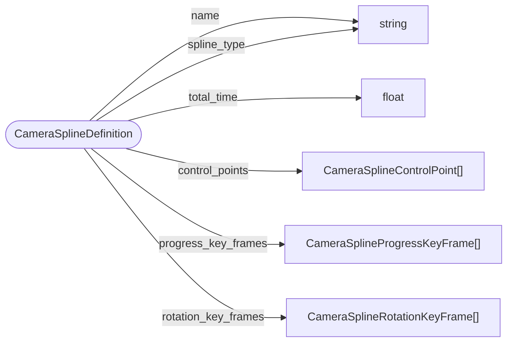

# CameraSplineDefinition

`struct`

```mermaid
flowchart LR
  ROOT(["CameraSplineDefinition"])
  ROOT -->|"name"| string["string"]
  ROOT -->|"total_time"| float["float"]
  ROOT -->|"spline_type"| string["string"]
  ROOT -->|"control_points"| CameraSplineControlPoint["CameraSplineControlPoint[]"]
  ROOT -->|"progress_key_frames"| CameraSplineProgressKeyFrame["CameraSplineProgressKeyFrame[]"]
  ROOT -->|"rotation_key_frames"| CameraSplineRotationKeyFrame["CameraSplineRotationKeyFrame[]"]
```

