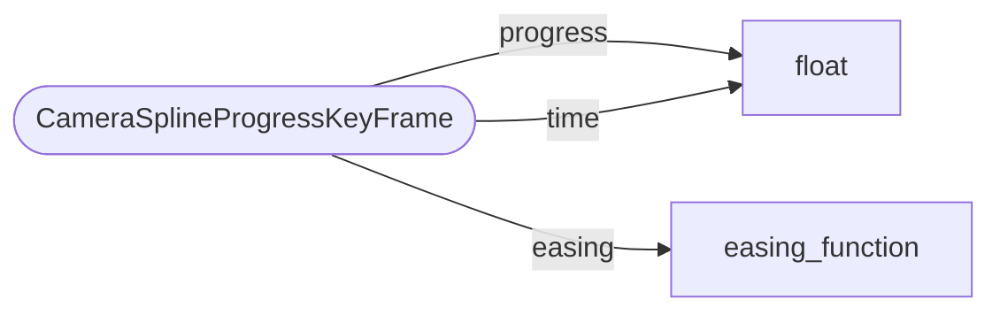

# CameraSplineProgressKeyFrame

`struct`

```mermaid
flowchart LR
  ROOT(["CameraSplineProgressKeyFrame"])
  ROOT -->|"progress"| float["float"]
  ROOT -->|"time"| float["float"]
  ROOT -->|"easing"| easing_function["easing_function"]
```

