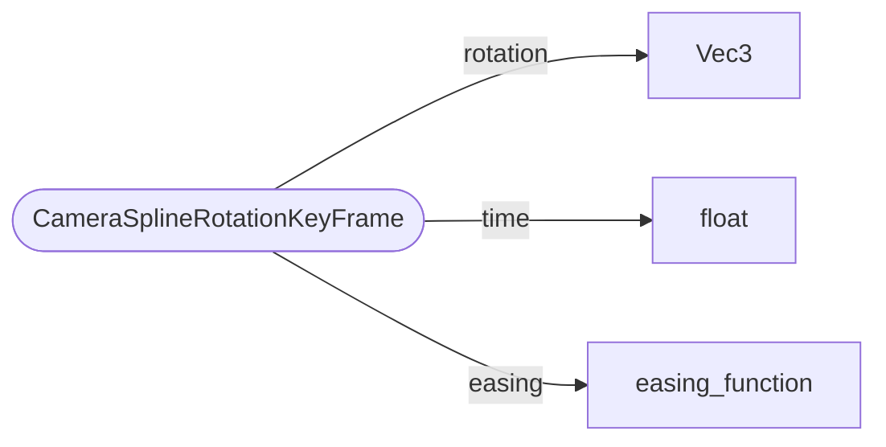

# CameraSplineRotationKeyFrame

`struct`

```mermaid
flowchart LR
  ROOT(["CameraSplineRotationKeyFrame"])
  ROOT -->|"rotation"| Vec3["Vec3"]
  ROOT -->|"time"| float["float"]
  ROOT -->|"easing"| easing_function["easing_function"]
```

