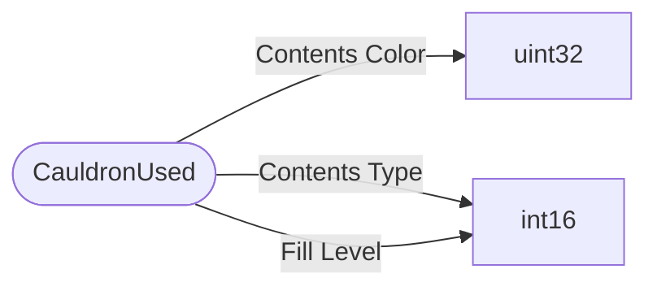

# CauldronUsed

`struct`

```mermaid
flowchart LR
  ROOT(["CauldronUsed"])
  ROOT -->|"Contents Color"| uint32["uint32"]
  ROOT -->|"Contents Type"| int16["int16"]
  ROOT -->|"Fill Level"| int16["int16"]
```

