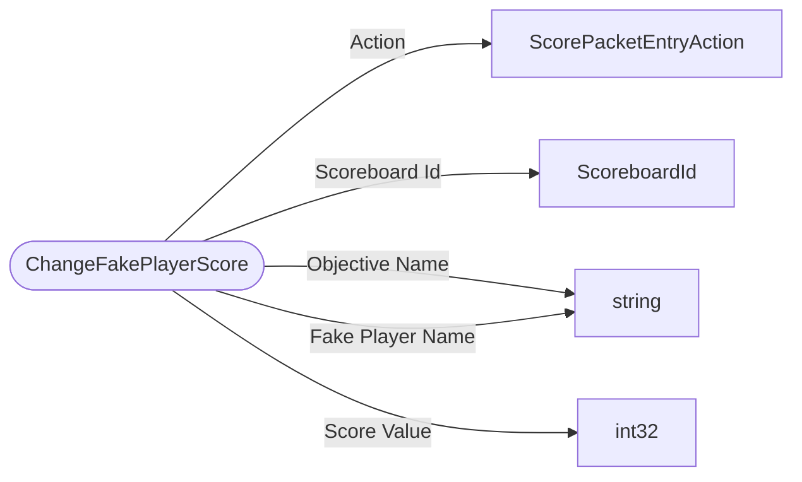

# ChangeFakePlayerScore

`struct`

```mermaid
flowchart LR
  ROOT(["ChangeFakePlayerScore"])
  ROOT -->|"Action"| ScorePacketEntryAction["ScorePacketEntryAction"]
  ROOT -->|"Scoreboard Id"| ScoreboardId["ScoreboardId"]
  ROOT -->|"Objective Name"| string["string"]
  ROOT -->|"Score Value"| int32["int32"]
  ROOT -->|"Fake Player Name"| string["string"]
```

