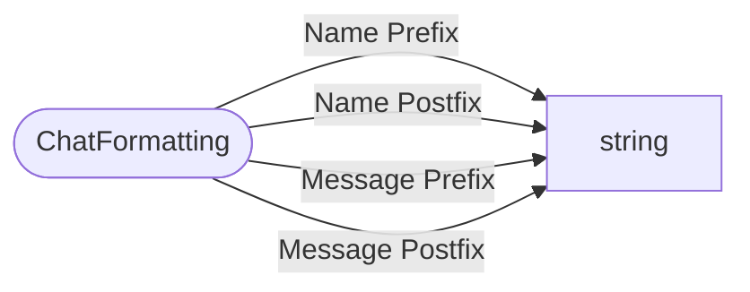

# ChatFormatting

`struct`

```mermaid
flowchart LR
  ROOT(["ChatFormatting"])
  ROOT -->|"Name Prefix"| string["string"]
  ROOT -->|"Name Postfix"| string["string"]
  ROOT -->|"Message Prefix"| string["string"]
  ROOT -->|"Message Postfix"| string["string"]
```

