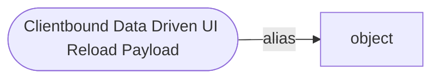

# Clientbound Data Driven UI Reload Payload

`alias`

- protocol: 2168
- minecraft: 1.26.40

```mermaid
flowchart LR
  ROOT(["Clientbound Data Driven UI Reload Payload"]) -->|alias| object["object"]
```

