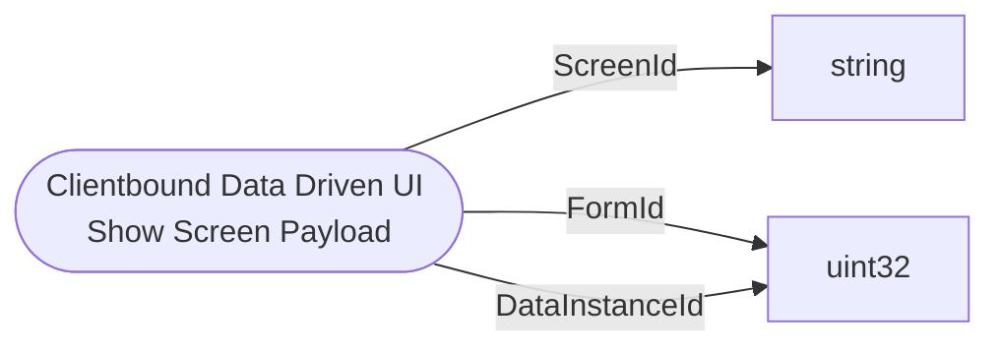

# Clientbound Data Driven UI Show Screen Payload

`struct`

- protocol: 2168
- minecraft: 1.26.40

```mermaid
flowchart LR
  ROOT(["Clientbound Data Driven UI Show Screen Payload"])
  ROOT -->|"ScreenId"| string["string"]
  ROOT -->|"FormId"| uint32["uint32"]
  ROOT -->|"DataInstanceId"| uint32["uint32"]
```

