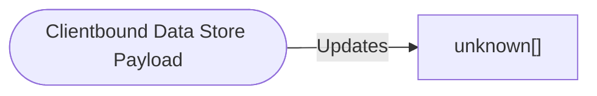

# Clientbound Data Store Payload

`struct`

- protocol: 2168
- minecraft: 1.26.40

```mermaid
flowchart LR
  ROOT(["Clientbound Data Store Payload"])
  ROOT -->|"Updates"| unknown["unknown[]"]
```

