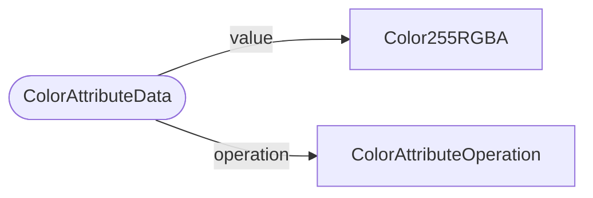

# ColorAttributeData

`struct`

```mermaid
flowchart LR
  ROOT(["ColorAttributeData"])
  ROOT -->|"value"| Color255RGBA["Color255RGBA"]
  ROOT -->|"operation"| ColorAttributeOperation["ColorAttributeOperation"]
```

