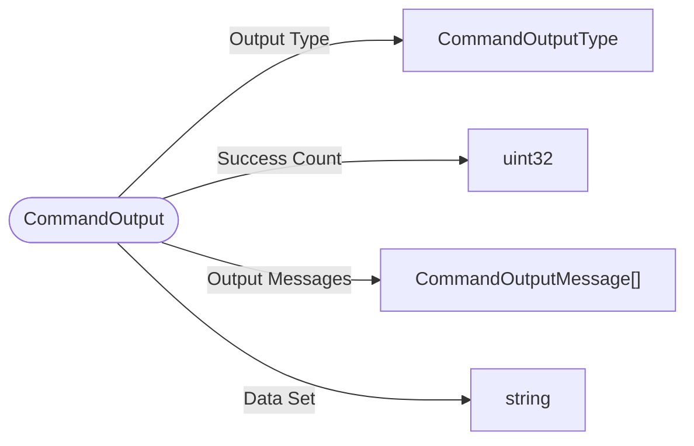

# CommandOutput

`struct`

```mermaid
flowchart LR
  ROOT(["CommandOutput"])
  ROOT -->|"Output Type"| CommandOutputType["CommandOutputType"]
  ROOT -->|"Success Count"| uint32["uint32"]
  ROOT -->|"Output Messages"| CommandOutputMessage["CommandOutputMessage[]"]
  ROOT -->|"Data Set"| string["string"]
```

