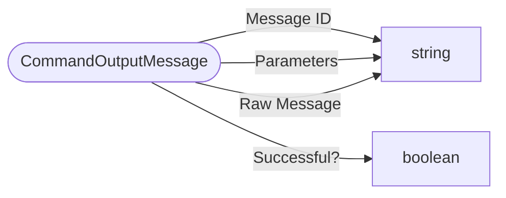

# CommandOutputMessage

`struct`

```mermaid
flowchart LR
  ROOT(["CommandOutputMessage"])
  ROOT -->|"Message ID"| string["string"]
  ROOT -->|"Successful?"| boolean["boolean"]
  ROOT -->|"Parameters"| string["string[]"]
  ROOT -->|"Raw Message"| string["string"]
```

