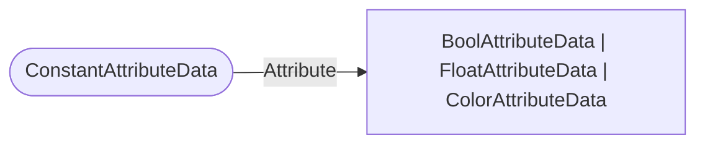

# ConstantAttributeData

`struct`

```mermaid
flowchart LR
  ROOT(["ConstantAttributeData"])
  ROOT -->|"Attribute"| BoolAttributeData___FloatAttributeData___ColorAttributeData["BoolAttributeData | FloatAttributeData | ColorAttributeData"]
```

