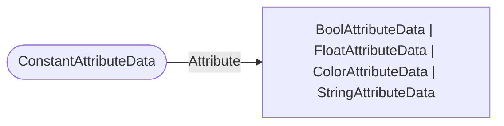

# ConstantAttributeData

`struct`

```mermaid
flowchart LR
  ROOT(["ConstantAttributeData"])
  ROOT -->|"Attribute"| BoolAttributeData___FloatAttributeData___ColorAttributeData___StringAttributeData["BoolAttributeData | FloatAttributeData | ColorAttributeData | StringAttributeData"]
```

