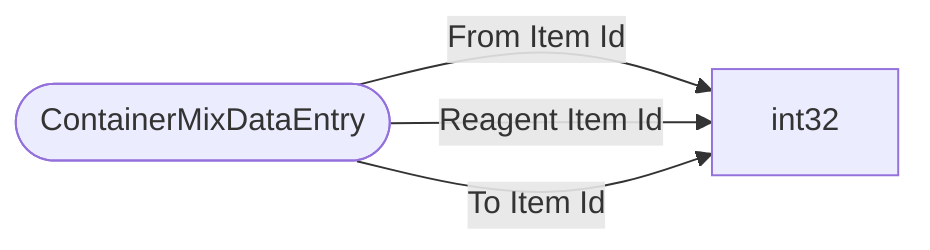

# ContainerMixDataEntry

`struct`

```mermaid
flowchart LR
  ROOT(["ContainerMixDataEntry"])
  ROOT -->|"From Item Id"| int32["int32"]
  ROOT -->|"Reagent Item Id"| int32["int32"]
  ROOT -->|"To Item Id"| int32["int32"]
```

