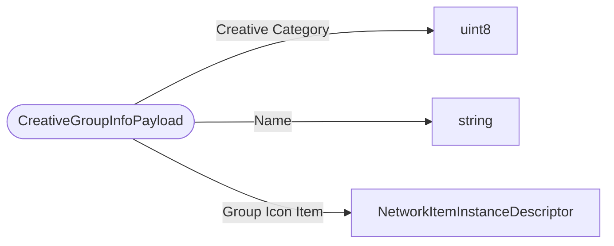

# CreativeGroupInfoPayload

`struct`

```mermaid
flowchart LR
  ROOT(["CreativeGroupInfoPayload"])
  ROOT -->|"Creative Category"| uint8["uint8"]
  ROOT -->|"Name"| string["string"]
  ROOT -->|"Group Icon Item"| NetworkItemInstanceDescriptor["NetworkItemInstanceDescriptor"]
```

