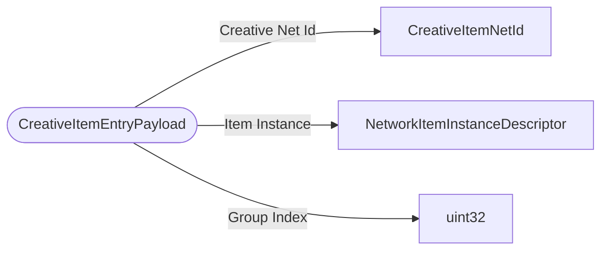

# CreativeItemEntryPayload

`struct`

```mermaid
flowchart LR
  ROOT(["CreativeItemEntryPayload"])
  ROOT -->|"Creative Net Id"| CreativeItemNetId["CreativeItemNetId"]
  ROOT -->|"Item Instance"| NetworkItemInstanceDescriptor["NetworkItemInstanceDescriptor"]
  ROOT -->|"Group Index"| uint32["uint32"]
```

