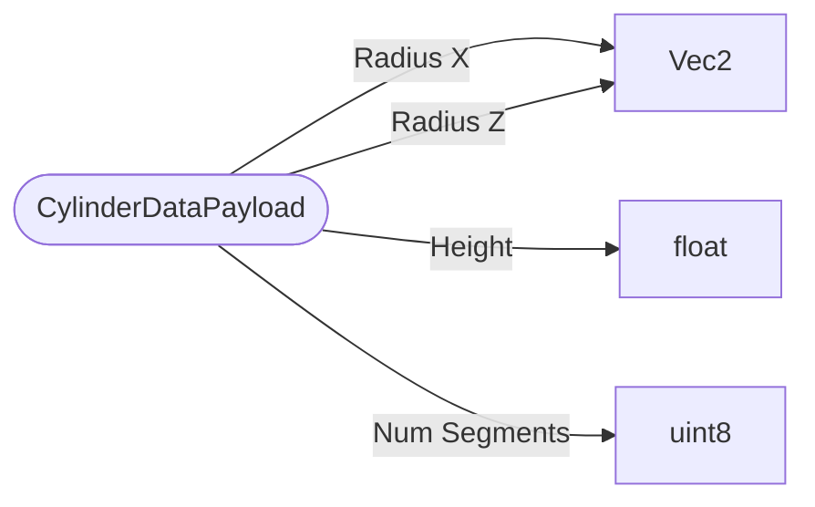

# CylinderDataPayload

`struct`

```mermaid
flowchart LR
  ROOT(["CylinderDataPayload"])
  ROOT -->|"Radius X"| Vec2["Vec2"]
  ROOT -->|"Radius Z"| Vec2["Vec2"]
  ROOT -->|"Height"| float["float"]
  ROOT -->|"Num Segments"| uint8["uint8"]
```

