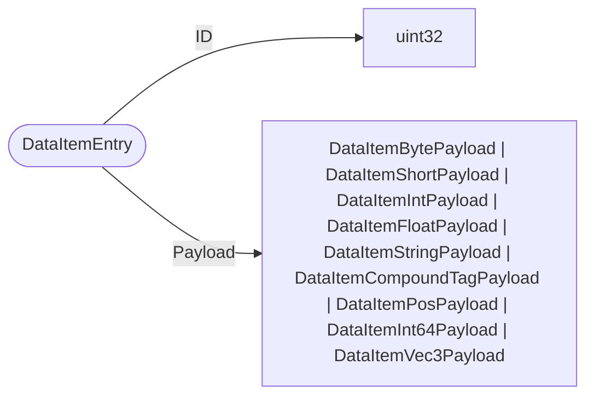

# DataItemEntry

`struct`

```mermaid
flowchart LR
  ROOT(["DataItemEntry"])
  ROOT -->|"ID"| uint32["uint32"]
  ROOT -->|"Payload"| DataItemBytePayload___DataItemShortPayload___DataItemIntPayload___DataItemFloatPayload___DataItemStringPayload___DataItemCompoundTagPayload___DataItemPosPayload___DataItemInt64Payload___DataItemVec3Payload["DataItemBytePayload | DataItemShortPayload | DataItemIntPayload | DataItemFloatPayload | DataItemStringPayload | DataItemCompoundTagPayload | DataItemPosPayload | DataItemInt64Payload | DataItemVec3Payload"]
```

