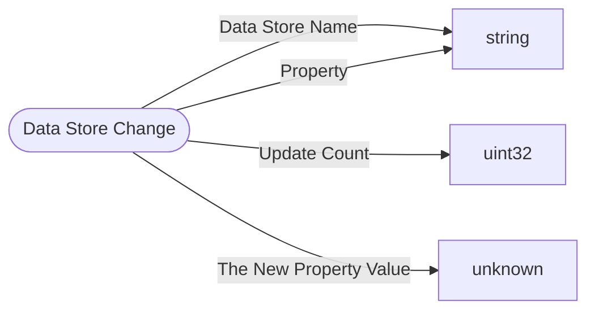

# Data Store Change

`struct`

```mermaid
flowchart LR
  ROOT(["Data Store Change"])
  ROOT -->|"Data Store Name"| string["string"]
  ROOT -->|"Property"| string["string"]
  ROOT -->|"Update Count"| uint32["uint32"]
  ROOT -->|"The New Property Value"| unknown["unknown"]
```

