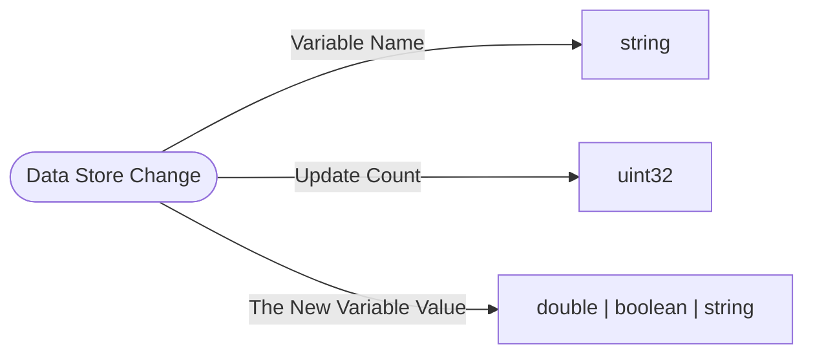

# Data Store Change

`struct`

```mermaid
flowchart LR
  ROOT(["Data Store Change"])
  ROOT -->|"Variable Name"| string["string"]
  ROOT -->|"Update Count"| uint32["uint32"]
  ROOT -->|"The New Variable Value"| double___boolean___string["double | boolean | string"]
```

