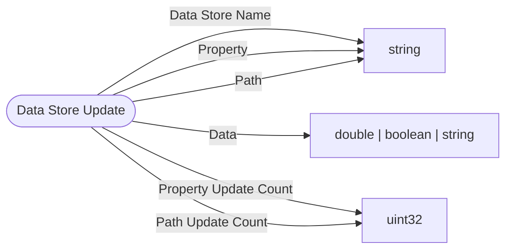

# Data Store Update

`struct`

```mermaid
flowchart LR
  ROOT(["Data Store Update"])
  ROOT -->|"Data Store Name"| string["string"]
  ROOT -->|"Property"| string["string"]
  ROOT -->|"Path"| string["string"]
  ROOT -->|"Data"| double___boolean___string["double | boolean | string"]
  ROOT -->|"Property Update Count"| uint32["uint32"]
  ROOT -->|"Path Update Count"| uint32["uint32"]
```

