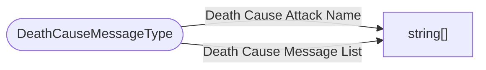

# DeathCauseMessageType

`struct`

```mermaid
flowchart LR
  ROOT(["DeathCauseMessageType"])
  ROOT -->|"Death Cause Attack Name"| string["string"]
  ROOT -->|"Death Cause Message List"| string["string[]"]
```

