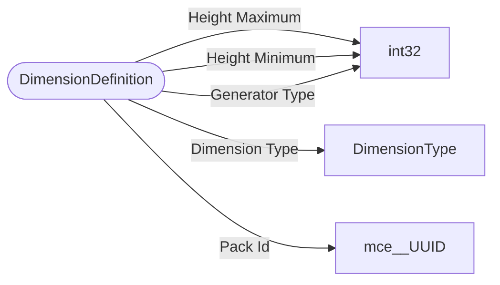

# DimensionDefinition

`struct`

```mermaid
flowchart LR
  ROOT(["DimensionDefinition"])
  ROOT -->|"Height Maximum"| int32["int32"]
  ROOT -->|"Height Minimum"| int32["int32"]
  ROOT -->|"Generator Type"| int32["int32"]
  ROOT -->|"Dimension Type"| DimensionType["DimensionType"]
  ROOT -->|"Pack Id"| mce__UUID["mce__UUID"]
```

