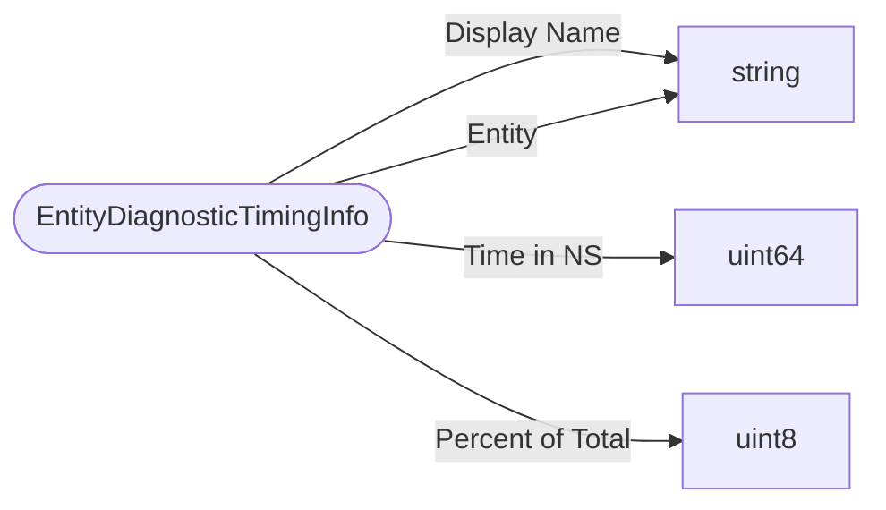

# EntityDiagnosticTimingInfo

`struct`

```mermaid
flowchart LR
  ROOT(["EntityDiagnosticTimingInfo"])
  ROOT -->|"Display Name"| string["string"]
  ROOT -->|"Entity"| string["string"]
  ROOT -->|"Time in NS"| uint64["uint64"]
  ROOT -->|"Percent of Total"| uint8["uint8"]
```

