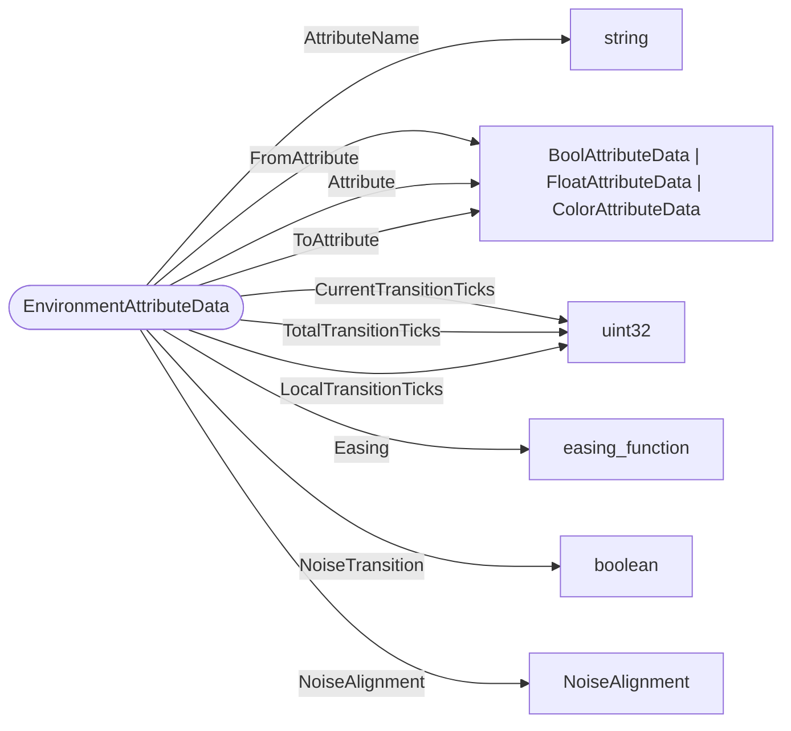

# EnvironmentAttributeData

`struct`

```mermaid
flowchart LR
  ROOT(["EnvironmentAttributeData"])
  ROOT -->|"AttributeName"| string["string"]
  ROOT -->|"FromAttribute"| BoolAttributeData___FloatAttributeData___ColorAttributeData["BoolAttributeData | FloatAttributeData | ColorAttributeData"]
  ROOT -->|"Attribute"| BoolAttributeData___FloatAttributeData___ColorAttributeData["BoolAttributeData | FloatAttributeData | ColorAttributeData"]
  ROOT -->|"ToAttribute"| BoolAttributeData___FloatAttributeData___ColorAttributeData["BoolAttributeData | FloatAttributeData | ColorAttributeData"]
  ROOT -->|"CurrentTransitionTicks"| uint32["uint32"]
  ROOT -->|"TotalTransitionTicks"| uint32["uint32"]
  ROOT -->|"Easing"| easing_function["easing_function"]
  ROOT -->|"LocalTransitionTicks"| uint32["uint32"]
  ROOT -->|"NoiseTransition"| boolean["boolean"]
  ROOT -->|"NoiseAlignment"| NoiseAlignment["NoiseAlignment"]
```

