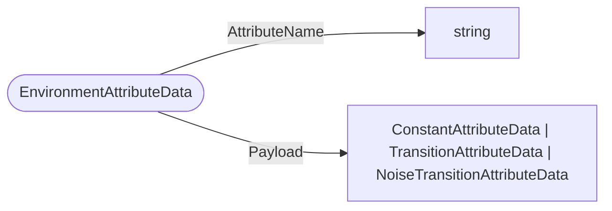

# EnvironmentAttributeData

`struct`

```mermaid
flowchart LR
  ROOT(["EnvironmentAttributeData"])
  ROOT -->|"AttributeName"| string["string"]
  ROOT -->|"Payload"| ConstantAttributeData___TransitionAttributeData___NoiseTransitionAttributeData["ConstantAttributeData | TransitionAttributeData | NoiseTransitionAttributeData"]
```

