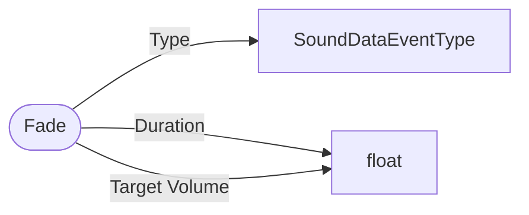

# Fade

`struct`

```mermaid
flowchart LR
  ROOT(["Fade"])
  ROOT -->|"Type"| SoundDataEventType["SoundDataEventType"]
  ROOT -->|"Duration"| float["float"]
  ROOT -->|"Target Volume"| float["float"]
```

