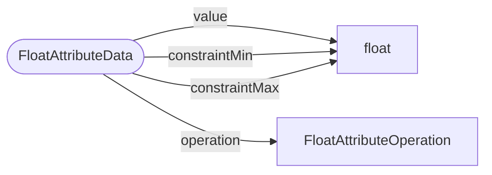

# FloatAttributeData

`struct`

```mermaid
flowchart LR
  ROOT(["FloatAttributeData"])
  ROOT -->|"value"| float["float"]
  ROOT -->|"operation"| FloatAttributeOperation["FloatAttributeOperation"]
  ROOT -->|"constraintMin"| float["float"]
  ROOT -->|"constraintMax"| float["float"]
```

