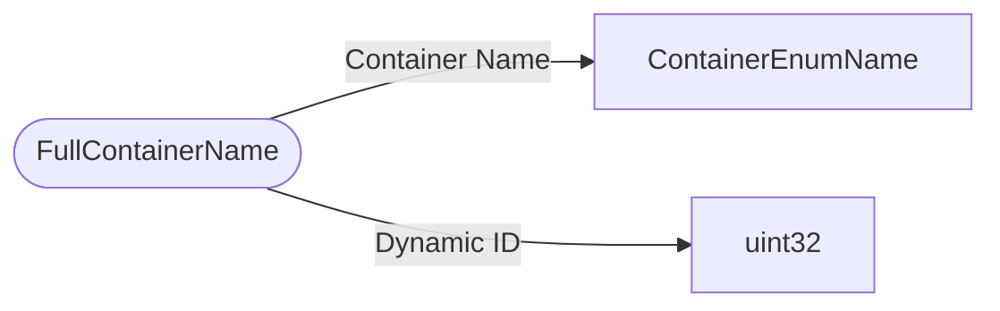

# FullContainerName

`struct`

```mermaid
flowchart LR
  ROOT(["FullContainerName"])
  ROOT -->|"Container Name"| ContainerEnumName["ContainerEnumName"]
  ROOT -->|"Dynamic ID"| uint32["uint32"]
```

