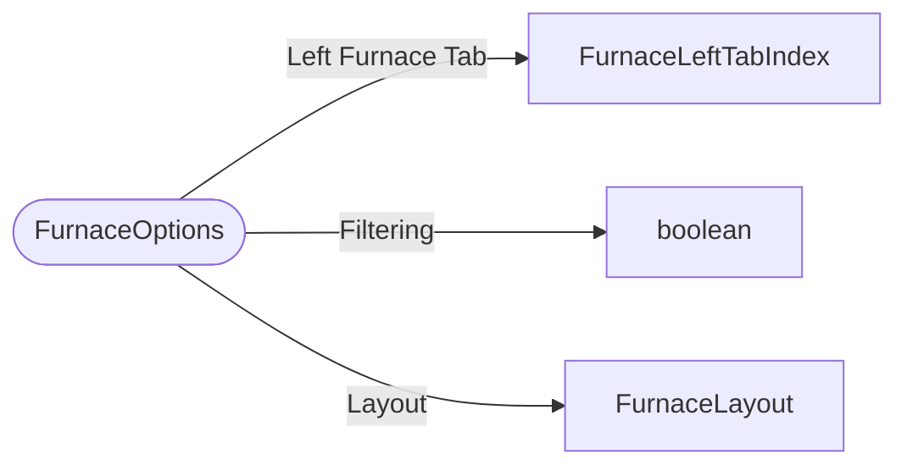

# FurnaceOptions

`struct`

```mermaid
flowchart LR
  ROOT(["FurnaceOptions"])
  ROOT -->|"Left Furnace Tab"| FurnaceLeftTabIndex["FurnaceLeftTabIndex"]
  ROOT -->|"Filtering"| boolean["boolean"]
  ROOT -->|"Layout"| FurnaceLayout["FurnaceLayout"]
```

