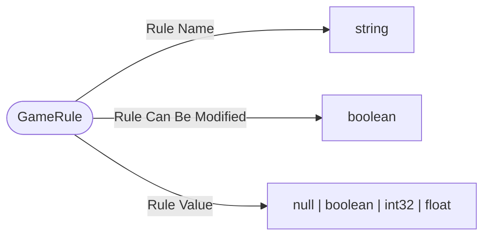

# GameRule

`struct`

```mermaid
flowchart LR
  ROOT(["GameRule"])
  ROOT -->|"Rule Name"| string["string"]
  ROOT -->|"Rule Can Be Modified"| boolean["boolean"]
  ROOT -->|"Rule Value"| null___boolean___int32___float["null | boolean | int32 | float"]
```

