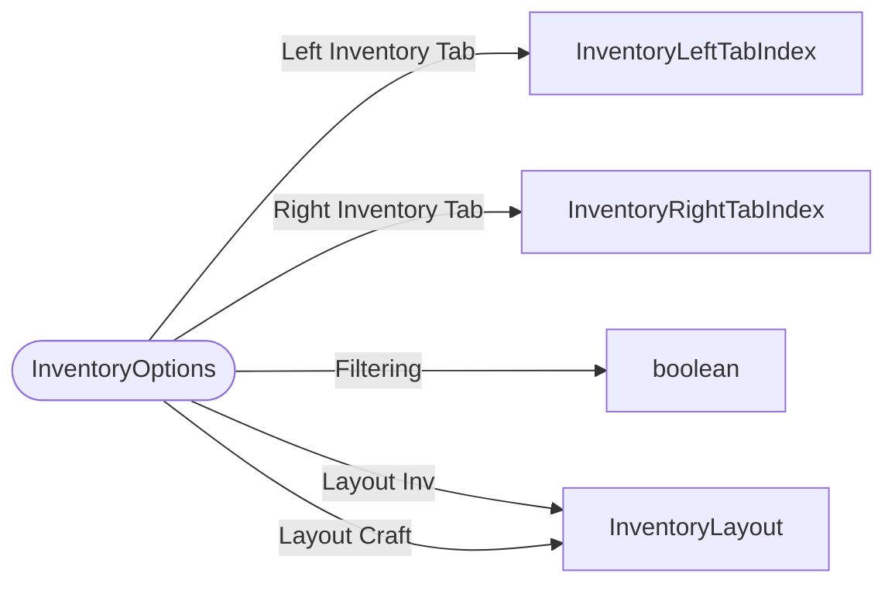

# InventoryOptions

`struct`

```mermaid
flowchart LR
  ROOT(["InventoryOptions"])
  ROOT -->|"Left Inventory Tab"| InventoryLeftTabIndex["InventoryLeftTabIndex"]
  ROOT -->|"Right Inventory Tab"| InventoryRightTabIndex["InventoryRightTabIndex"]
  ROOT -->|"Filtering"| boolean["boolean"]
  ROOT -->|"Layout Inv"| InventoryLayout["InventoryLayout"]
  ROOT -->|"Layout Craft"| InventoryLayout["InventoryLayout"]
```

