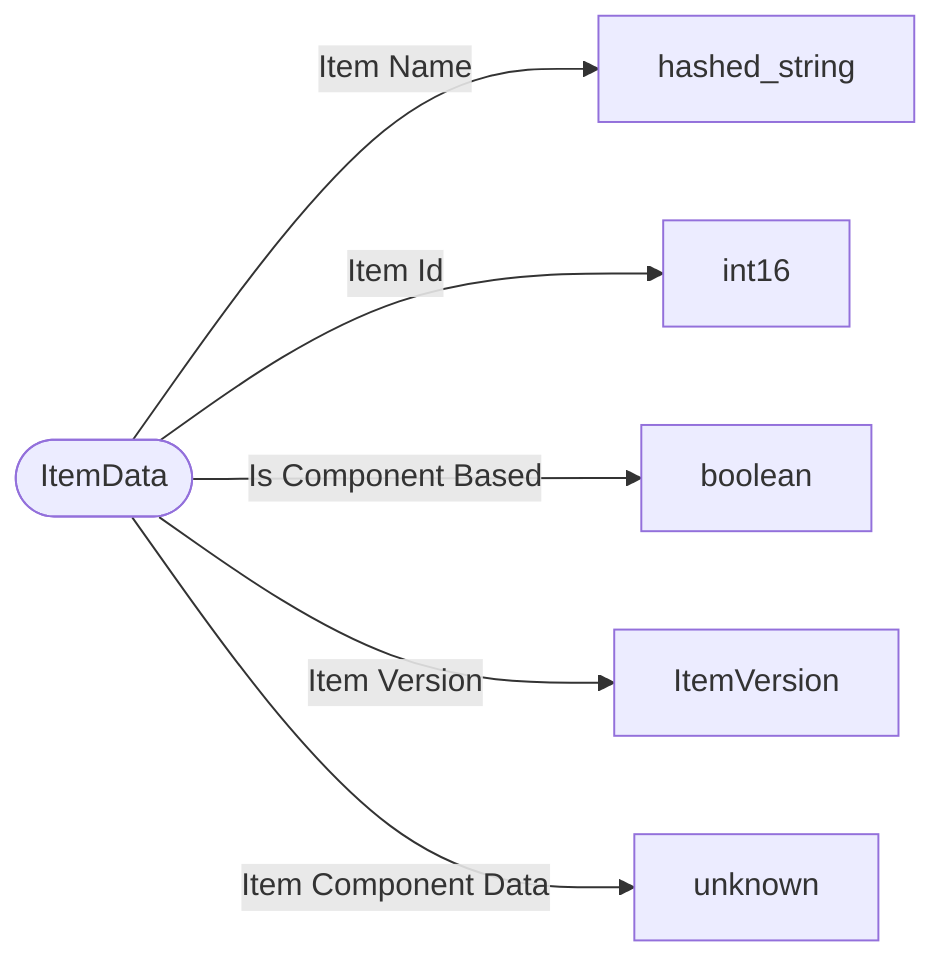

# ItemData

`struct`

```mermaid
flowchart LR
  ROOT(["ItemData"])
  ROOT -->|"Item Name"| hashed_string["hashed_string"]
  ROOT -->|"Item Id"| int16["int16"]
  ROOT -->|"Is Component Based"| boolean["boolean"]
  ROOT -->|"Item Version"| ItemVersion["ItemVersion"]
  ROOT -->|"Item Component Data"| unknown["unknown"]
```

