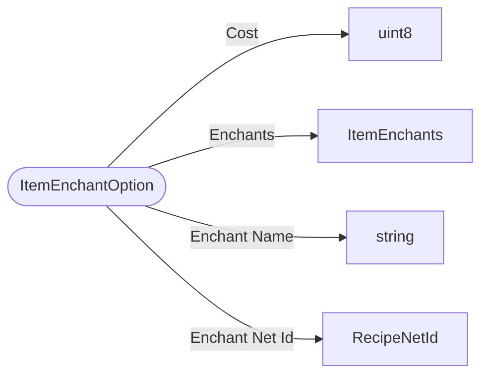

# ItemEnchantOption

`struct`

```mermaid
flowchart LR
  ROOT(["ItemEnchantOption"])
  ROOT -->|"Cost"| uint8["uint8"]
  ROOT -->|"Enchants"| ItemEnchants["ItemEnchants"]
  ROOT -->|"Enchant Name"| string["string"]
  ROOT -->|"Enchant Net Id"| RecipeNetId["RecipeNetId"]
```

