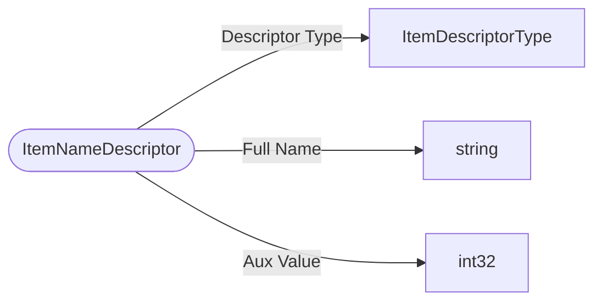

# ItemNameDescriptor

`struct`

```mermaid
flowchart LR
  ROOT(["ItemNameDescriptor"])
  ROOT -->|"Descriptor Type"| ItemDescriptorType["ItemDescriptorType"]
  ROOT -->|"Full Name"| string["string"]
  ROOT -->|"Aux Value"| int32["int32"]
```

